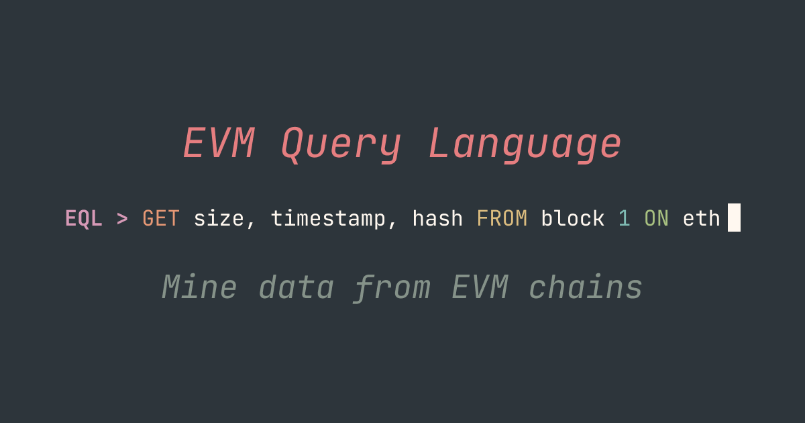

# EVM Query Language


EVM Query Language (EQL) is a SQL-like language designed to query EVM chains, aiming to support complex relational queries on EVM chain first-class citizens (blocks, accounts, and transactions). It provides an ergonomic syntax for developers and researchers to compose custom datasets without boilerplate code.


[Try it here](https://eql-app.vercel.app/)

## Goals
EQL's primary goal is to support relational queries for Ethereum entities such as blocks, accounts, and transactions. The challenge lies in Ethereum's storage model, which stores these entities under key-value databases, indexing values by a single key. Linear searches over RPCs can be extremely slow, so research is being done to find the best way to distribute Ethereum state data and allow performant relational queries.

Additionally, EQL aims to extend its syntax beyond simple read operations, empowering developers and researchers with tools to compose custom datasets efficiently.
## The Problem
Ethereum clients store blocks, transactions, and accounts using a key-value model, making complex blockchain data analysis non-trivial. For instance, fetching all transaction values from a given block using TypeScript requires a disproportionate amount of code. Developers and researchers face productivity hindrances due to boilerplate code and public RPC rate limits.

## How EQL Wants to Solve It
EQL aims to bridge the gap between data exploration and developer/researcher experience by focusing on two main areas:
### Query Performance
Research is being conducted to provide fully relational queries for Ethereum's first-class citizens. Key principles guiding R&D include data access without requiring a full-node and avoiding centralization.
### Ergonomics
EQL aims to provide a small footprint on existing codebases and enhance productivity for beginners with a simple yet powerful syntax.
## Interpreter
EQL is an interpreted language mapping structured queries to JSON-RPC providers. The interpreter is divided into two phases: frontend and backend.
- **Frontend:** Takes the source of the program (queries), splits it into tokens, assesses the correctness of the expressions provided, and returns an array of structured expressions.
- **Backend:** Receives the array of expressions, maps them to JSON-RPC calls, and formats the responses to match the query requirements.
This allows interaction with EVM chain data and various operations on entities like accounts, blocks, and transactions.
## Usage
Queries can be run by executing `.eql` files with the `run` command:
```bash
eql run <file>.eql
```

Using the language REPL:
```sh
eql repl
```

Or incorporating the interpreter directly in your app. [See](https://github.com/iankressin/eql/blob/main/crates/core/README.md):
```sh
[dependencies]
eql_core = "0.1"
```

## Installation
To install the CLI you will need `eqlup`, the EQL version manager:
```sh
curl https://raw.githubusercontent.com/iankressin/eql/main/eqlup/install.sh | sh
```

Next, install the latest version of EQL:
```sh
eqlup
```

### Updating EQL
To update EQL to the latest version, run `eqlup` again:
```
eqlup
```

## Expressions

### GET
_Description:_ Read one or more fields from an entity, given an entity and an id.

_Production:_ `GET <[fields, ]> FROM <entity> <entity_id> ON <chain>`

_Example:_ `GET nonce, balance FROM account vitalik.eth ON base`
### SEND (Soon)
_Description:_ Sends a transaction to the network.

_Production:_ `SEND <type> to=<address>, value=<ether>, data=<bytes> ON <chain>`

_Example:_ `SEND TX to=vitalik.eth, value=1, data=0x0...000 ON arbitrum`
### MATH (Soon)
_Description:_ Supports basic math operations like SUM, SUB, DIV, TIMES.

_Production:_ `<operator>(<[expr, ]>)`

_Example:_ `SUM(GET balance FROM vitalik.eth ON base, GET balance FROM vitalik.eth ON ethereum)`
## Entities
These are the entities that can be queried using the EQL language, each addressed by its name and an id:
### Account
- address [id]
- nonce
- balance
- code
### Block
- number [id]
- timestamp
- size
- hash
- parent_hash
- state_root
- transactions_root
- receipts_root
- logs_bloom
- extra_data
- mix_hash
- total_difficulty
- base_fee_per_gas
- withdrawals_root
- blob_gas_used
- excess_blob_gas
- parent_beacon_block_root
### Transaction
- hash [id]
- transaction_type 
- from 
- to 
- data 
- value 
- gas_price 
- gas 
- status 
- chain_id 
- v 
- r 
- s 
- max_fee_per_blob_gas 
- max_fee_per_gas 
- max_priority_fee_per_gas 
- y_parity
